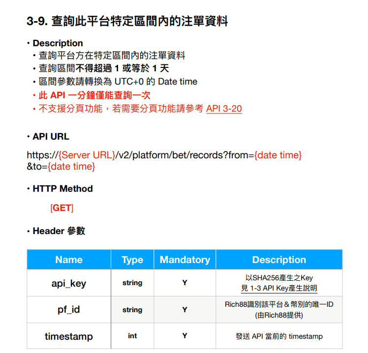

# NotHttpResponseException

<figure><figcaption></figcaption></figure>

1. 首先跟值班索取哪隻Api和Platform and SubPlatform ID。
2. 打開Rich88串接文件搜尋該api：

<figure><figcaption></figcaption></figure>

call api 需要先設定header如下：

```javascript
let pf_id = pm.environment.get('pf_id');
let pf_key = pm.environment.get('pf_key');
let timestamp = '0';
let plain = pf_id + pf_key + timestamp;
var key = CryptoJS.SHA256(plain).toString();
pm.request.headers.upsert({key: 'timestamp', value: timestamp});
pm.request.headers.upsert({key: 'pf_id', value: pf_id});
pm.request.headers.upsert({key: 'api_key', value: key});
pm.collectionVariables.set({key: 'txNo', value: new Date().getTime()})js
```

環境參數：

<figure><figcaption><p>去資料庫找業主的pf_<em>id和pf_key</em></p></figcaption></figure>

<mark style="background-color:red;">**發送api後發現讀取時間太久，原因是該業主的單量太大，所以回送速度太慢導致timeout**</mark>


通常api NotHttpResponseException都是這個問題

